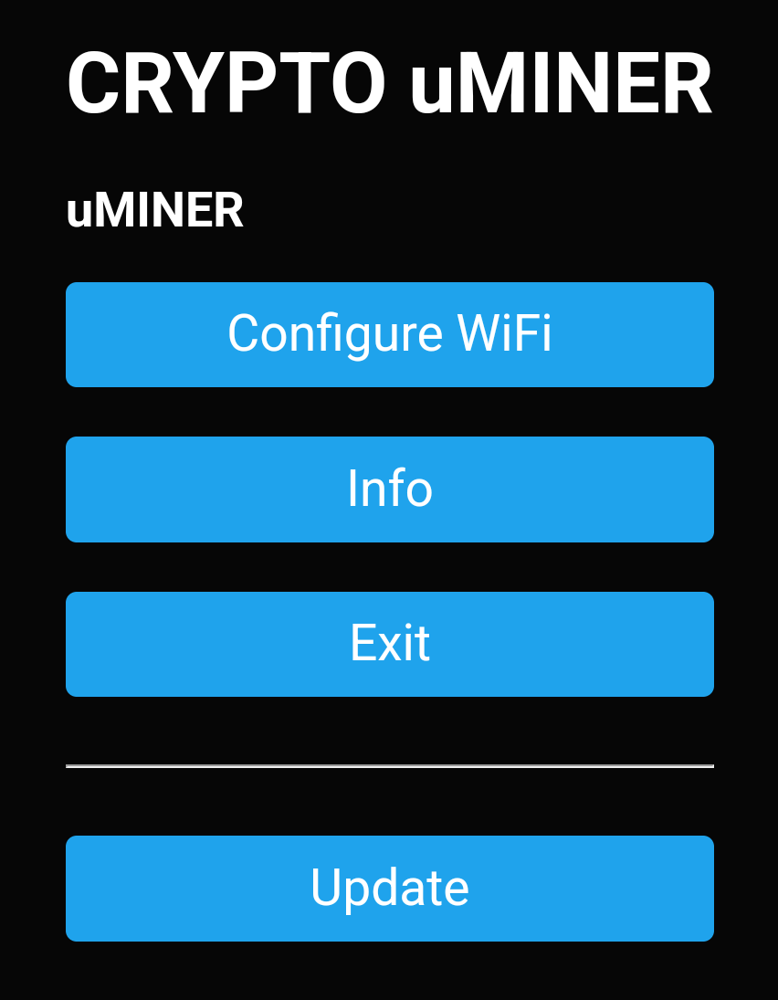

# CRYPTO μMiner

A *solo crypto miner* for a little T-Display S3 (ESP32).  

  
  

(Node: This was inspired by other miner software like: [https://github.com/valerio-vaccaro/HAN](https://github.com/valerio-vaccaro/HAN))

## Overview

Assuming you have a **CRYPTO μMiner** with an already installed software image.  
(In case you want to build and upload a new image refer to the [Flash](#flash) section below.)

### Connect to the network

1. Boot the **CRYPTO μMiner** by connecting a USB-C power supply.  
		 
2. The **CRYPTO μMiner** now tries to connect with a Wi-Fi network.  
	 If this fails (typically because there is no correct Wi-Fi access data being configured), it will change to the "-CONNECTING-" screen where a QR-code with its access point details is displayed.  
	 Connect with your smartphone to the **uMINER** Wi-Fi access point:  
	 
	 
		 
3. Press the \[Configure WiFi\] button and enter the SSID and password of your Wi-Fi.  
	 After saving the **CRYPTO μMiner** is going to restart and connect with your Wi-Fi.

### Select Screens

After each start and successful connection with the network, the **CRYPTO μMiner** is going to show the "-ONLINE-" mining screen.  
By applying a short press to the SCREEN button you can cycle to the screens:

* ONLINE  
* CLOCK  
* NETWORK  
* STATUS

### Configure the display

The display can be changed using the DISPLAY button:

* Single press  
	Toggle the display on/off  
* Long press  
	Adjust the display backlight brightness  
* Double press  
	Rotate the the display by 180° degrees

### Force Setup

To force the **CRYPTO μMiner** to switch into the "-CONNECTING-" screen, you would need to press reset button and then keep the SCREEN button pressed
(while in the initial "-OFFLINE-" screen) until it switches into the "-CONNECTING-" screen.

## Flash {#flash}

For flashing a [release](https://github.com/cjaeckel/uMINER/releases) build, you need to install the [Espressif esptool](https://docs.espressif.com/projects/esptool/en/latest/esp32/index.html) with Python:

`pip install esptool`

Then flash the downloaded release image using this command:

`esptool --port "<your port here>" write_flash 0x0000 uMINER_v3.100.bin`

## Build

The **CRYPTO μMiner** project could be built using [platformIO](https://platformio.org/).  